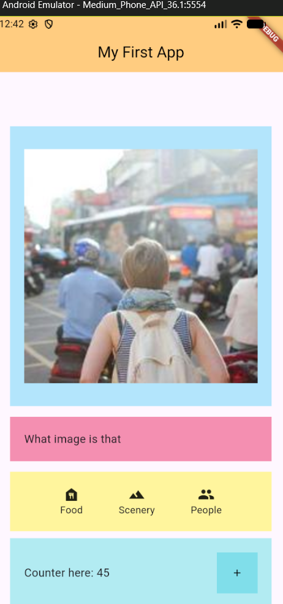

# Intro to Widget in Flutter & Stateless vs Stateful Widget

Widget adalah blok bangunan dasar (building blocks) yang mendeskripsikan bagaimana tampilan aplikasi seharusnya terlihat berdasarkan konfigurasi dan statusnya saat ini.

Ada 2 jenis widget yang umum digunakan dalam aplikasi mobile, yakni:

* Stateless Widget

  Stateless Widget adalah widget yang bersifat statis. Sekali widget ini dibangun (built), ia tidak akan pernah berubah selama masa hidupnya. Widget ini tidak memiliki "state" atau memori internal yang dapat dimutasi.

  * **Contoh Komponen** : `Icon`, `Text`, `IconButton` (tanpa logika perubahan angka), atau logo perusahaan.
  * **Contoh Aplikasi** : Halaman "About Us" atau deskripsi produk yang informasinya tetap.
* Stateful Widget

  Stateful Widget adalah widget yang bersifat dinamis. Widget ini memiliki objek *State* yang memungkinkannya untuk menyimpan data yang dapat berubah selama aplikasi berjalan (seperti input pengguna, data dari API, atau perubahan waktu).

  **Contoh Studi Kasus:**

  * **Gojek/Grab** : Tampilan beranda yang berubah secara dinamis. Misalnya, sapaan "Selamat Pagi" yang berubah menjadi "Selamat Malam" mengikuti jam sistem, atau pergerakan ikon driver di peta.
  * **Fitur Keranjang** : Angka jumlah barang yang bertambah saat tombol "+" ditekan.

Pada Pertemuan 2, kita akan mencoba membuat aplikasi sederhana di fiutter dan menerapkan prinsip widget serta mencoba membuat sebuah stateful widget.

Overview Aplikasi yang Dibuat:



## Widget Tree

Flutter menggunakan pendekatan komposisi, di mana widget kecil dikombinasikan untuk membentuk widget yang lebih besar, menciptakan sebuah struktur hierarkis yang disebut  **Widget Tree** .

Dalam aplikasi yang akan dibuat, ini adalah widget treenya:

```
MyApp (StatelessWidget)
└─ MaterialApp (Root Configuration)
   └─ RowColumnPage (StatelessWidget - Main Screen)
      └─ Scaffold (Layout Structure)
         ├─ AppBar (Top Header)
         │  └─ Text ("My First App")
         └─ Column (Main Vertical Body)
            ├─ Container (Image Section)
            │  └─ AspectRatio
            │     └─ Container
            │        └─ Center
            │           └─ Image.network (Content)
            ├─ Container (Label Section)
            │  └─ Text ("What image is that")
            ├─ Container (Icon Menu Section)
            │  └─ Row (Horizontal Layout)
            │     ├─ Column (Icon + Text: Food)
            │     ├─ Column (Icon + Text: Scenery)
            │     └─ Column (Icon + Text: People)
            └─ CounterCard (Custom StatefulWidget)
               └─ Container
                  └─ Row
                     ├─ Text (Display Counter)
                     └─ Container (Button Wrapper)
                        └─ IconButton
```


## Widget Breakdown 

### MaterialApp

`MaterialApp` bertindak sebagai pembungkus utama yang menyediakan fitur-fitur dasar material design seperti navigasi, tema, dan pengaturan bahasa.

```
// Bagian dari class MyApp
return MaterialApp(
  title: 'Flutter Demo',
  theme: ThemeData(
    colorScheme: ColorScheme.fromSeed(seedColor: Colors.deepPurple),
    useMaterial3: true,
  ),
  home: const RowColumnPage(), // Menentukan halaman pertama yang muncul
);
```

### Scaffold & AppBar

`Scaffold` menyediakan struktur dasar halaman (seperti kanvas kosong yang sudah memiliki slot untuk header dan body). `Scaffold` mengelola ruang layar. 

`AppBar` berfungsi sebagai bar navigasi/judul di bagian atas.

```
// Bagian dari class RowColumnPage
return Scaffold(
  appBar: AppBar(
    title: const Text('My First App'),
    backgroundColor: Colors.orange[200],
    centerTitle: true,
  ),
  body: Column( ... ), // Isi utama aplikasi ditempatkan di sini
);
```

### Column

Widget `Column` digunakan untuk menyusun elemen dari atas ke bawah. 

```
body: Column(
  crossAxisAlignment: CrossAxisAlignment.center, // Perataan horizontal anak-anaknya
  mainAxisAlignment: MainAxisAlignment.center,  // Perataan vertikal anak-anaknya
  children: <Widget>[
    // Berisi Container Image, Container Text, Row Icon, dan CounterCard
  ],
),
```


* **Komponen Terkait**: `Container`, `AspectRatio`, `Center`, `Image`.
* **Fungsi** : `AspectRatio` menjaga dimensi gambar, sedangkan `Container` memberikan dekorasi warna latar dan jarak (margin/padding).

### Horizontal Layout

```
Container (Yellow Background)
└─ Row (Horizontal Alignment)
   ├─ Column (Item 1)
   │  ├─ Icon (Icons.food_bank)
   │  └─ Text ("Food")
   ├─ Column (Item 2)
   │  ├─ Icon (Icons.landscape)
   │  └─ Text ("Scenery")
   └─ Column (Item 3)
      ├─ Icon (Icons.people)
      └─ Text ("People")

```


Komponen dalam aplikasi

```
Container(
  color: Colors.yellow[200],
  padding: EdgeInsets.all(20.0),
  child: Row(
    mainAxisAlignment: MainAxisAlignment.spaceEvenly, // Distribusi rata horizontal
    children: <Widget>[
      Column(children: [Icon(Icons.food_bank), Text("Food")]),
      Column(children: [Icon(Icons.landscape), Text("Scenery")]),
      Column(children: [Icon(Icons.people), Text("People")]),
    ],
  ),
)
```


Penjelasan Elemen:

* **`Row`** : Bertugas menyusun elemen secara menyamping.
* **`mainAxisAlignment: MainAxisAlignment.spaceEvenly`** : Memberikan jarak kosong yang sama di antara, sebelum, dan sesudah setiap item, sehingga tampilan terlihat proporsional tanpa perlu menghitung margin manual.
* **`Column` (di dalam Row)** : Digunakan untuk menumpuk Ikon dan Teks secara vertikal sehingga teks berada tepat di bawah ikon.


### CounterCard (StatefulWidget)

```
CounterCard (StatefulWidget)
└─ Container (Cyan Background)
   └─ Row (Space Between)
      ├─ Text ("Counter here: $_counter")
      └─ Container (Button Background)
         └─ IconButton (Action Trigger)
            └─ Icon (Icons.add)

```

Komponen dalam aplikasi

* Logic State (Counter)

```
class _CounterCardState extends State<CounterCard> {
  int _counter = 0; // Data/State yang dipantau

  void _incrementCounter() {
    setState(() {
      _counter++; // Mengubah data dan memicu gambar ulang (rebuild)
    });
  }
  // ... build widget
}
```

* UI

```
Row(
  mainAxisAlignment: MainAxisAlignment.spaceBetween, // Teks di kiri, tombol di kanan
  children: [
    Text("Counter here: $_counter"), // Menampilkan nilai variabel terbaru
    IconButton(
      onPressed: _incrementCounter, // Memanggil fungsi penambah saat diklik
      icon: Icon(Icons.add),
    ),
  ],
)

```

Penjelasan Elemen:

* `CounterCard` : dapat "mengingat" data.
* **`_counter`** : Variabel penyimpan data angka.
* **`setState()`** : Mekanisme yang memberitahu *framework* Flutter bahwa status internal telah berubah (mutasi data). Hal ini memicu siklus pembangunan ulang ( *rebuild cycle* ) pada widget tersebut agar perubahan nilai variabel dapat tercermin pada UI secara instan. Misal pada contoh aplkasi, nilai counter telah diubah pada pemencetan tombol "+", maka nilai yang ditampilkan akan berubah mengikuti 
* **`mainAxisAlignment: MainAxisAlignment.spaceBetween`** : Memisahkan informasi teks dan tombol aksi ke dua ujung kontainer, menciptakan hierarki visual yang bersih.
