# 03. Widgets - Images, Buttons, Icons, Containers & Padding, Rows, Columns

[Previous](/02.%20Creating%20App,%20Scaffold,%20AppBar,%20Colours,%20Fonts/) | [Main Page](/) | [Next](/04.%20Stateful%20and%20Starting%20the%20World%20Time%20App/)

## Content Outline

- [Widgets](#widgets)
  - [Widget composition](#widget-composition)
  - [Widget state](#widget-state)
    - [StatelessWidget](#statelesswidget)
    - [StatefulWidget](#statefulwidget)
  - [Common Widgets](#common-widgets)
    - [Scaffold](#scaffold)
    - [Padding](#padding)
    - [ColoredBox](#coloredbox)
    - [Center](#center)
    - [Container](#container)
    - [Row and Column](#row-and-column)
- [Images](#images)
  - [Network Image](#network-image)
  - [Asset Image](#asset-image)
- [Buttons & Icons](#buttons--icons)
  - [Icons](#icons)
  - [Buttons](#buttons)
- [Containers & Padding](#containers--padding)
- [Rows & Columns](#rows--columns)
- [Challenge](#challenge)

## Widgets

In Flutter, **everything you see on screen is a widget**. Text, buttons, images, padding, alignment, even the overall page structure, all of these are widgets. This is captured in the well-known Flutter principle:

> *"Flutter is all about widgets."*

Widgets are the **building blocks** of a Flutter application's user interface. They are comparable to components in ReactJS or elements in HTML, but in Flutter, they are used far more extensively, even layout logic (centering, spacing) is expressed as a widget.

### Widget composition

A widget can have child widgets in the form of attributes. Widgets relationships are hierarchical, and the parent widget can have multiple child widgets. Here is an example of a widget composition for this code.

```dart
void main() {
  runApp(MaterialApp(
    home: Scaffold(
      appBar: AppBar(
        title: Text("My first app"),
        centerTitle: true,
        backgroundColor: Colors.amber[200],
      ),
      body: Center(
        child: Text(
          'Hello World!',
          style: TextStyle(
            fontSize: 20.0,
            fontWeight: FontWeight.bold,
            letterSpacing: 2.0,
            color: Colors.grey[600],
          ),
        ),
      ),
      floatingActionButton: FloatingActionButton(
        onPressed: () {},
        child: Text('click'),
        backgroundColor: Color(0xFF42A5F5),
      ),
    ),
  ));
}
```

<div align="center">

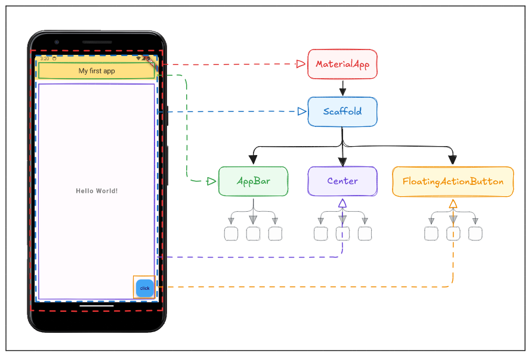

</div>

Widget are able to be nested within each other to create complex user interfaces. For example, a `Scaffold` widget can contain an `AppBar`, a `Center` as a body, a `FloatingActionButton`, and more.

### Widget State

Before diving into each widget type, it is essential to understand what **state** means in the context of Flutter.

**State** is any data that:
1. Is held by a widget at a particular moment in time, **and**
2. Can **change** during the lifetime of the application, **and**
3. When it changes, it causes the widget's **visual output to update**.

### Types of Widgets based on State

Flutter categorises all widgets into two primary types based on one essential question:

> **Does this widget need to remember or change any data over time?**

| Property | StatelessWidget | StatefulWidget |
|---|---|---|
| Has internal data that changes? | ❌ No | ✅ Yes |
| Can update its appearance after creation? | ❌ No | ✅ Yes |
| Complexity | Lower | Higher |
| Performance overhead | Lower | Slightly higher |
| Use case | Static UI elements | Interactive, dynamic UI |

Widgets can be stateless or stateful. 
- Stateless widgets are immutable, meaning that their properties can't change, all values are final (used for static content).
- Stateful widgets maintain state that might change during the lifetime of the widget (used for dynamic content).

Use the following questions as a guide when deciding between the two widget types:

```
Does this widget need to store any data that changes while the app is running?
│
├── NO  → Use StatelessWidget
│         (e.g., labels, icons, static cards, app bar titles)
│
└── YES → Ask: Where does the change come from?
          │
          ├── From the PARENT (parent rebuilds with new data)
          │   → StatelessWidget is still sufficient
          │   (e.g., a label whose text is controlled by a parent page)
          │
          └── From WITHIN the widget (user interaction, timer, network response)
              → Use StatefulWidget
              (e.g., a like button, a form field, an animation)
```

#### Scoreboard Analogy
Imagine a basketball scoreboard. The scoreboard displays two numbers: the score for Team A and the score for Team B. Every time a team scores a point, the scoreboard's data (the scores) changes, and the display updates immediately to reflect the new values.

- The **current scores** are the **state**.
- The act of **updating the display** after a score change is equivalent to Flutter **rebuilding** (re-rendering) the widget.

A widget with no state is like a photograph of the scoreboard, it shows fixed information and never changes regardless of what happens in the game.

#### StatelessWidget

For this module, we will focus on stateless widgets that provided by Flutter. `StatelessWidget` is a widget that **does not hold any internal state**. It is rendered once based on the configuration (properties) it receives from its parent, and its visual output remains constant unless the parent widget rebuilds it with new properties.

**When to use?**
- To display static content (text, images, icons) that does not need to be updated.
- UI parts that depend only on data passed through the constructor (no user interaction that changes the appearance).
- It **cannot modify its own appearance** from within.

**How to create a StatelessWidget:**

A class must extend `StatelessWidget` and override the `build()` method that returns a widget.

```dart
import 'package:flutter/material.dart';

// StatelessWidget definition
class MyCard extends StatelessWidget {
  // Parameters can be received through the constructor
  final String title;
  final String subtitle;

  // Constructor
  const MyCard({super.key, required this.title, required this.subtitle});

  // The build() method must be overridden — returns the widget's appearance
  @override
  Widget build(BuildContext context) {
    return Card(
      elevation: 4.0,
      child: Padding(
        padding: EdgeInsets.all(16.0),
        child: Column(
          crossAxisAlignment: CrossAxisAlignment.start,
          children: [
            Text(
              title,
              style: TextStyle(fontSize: 18.0, fontWeight: FontWeight.bold),
            ),
            SizedBox(height: 8.0),
            Text(subtitle),
          ],
        ),
      ),
    );
  }
}

void main() {
  runApp(MaterialApp(
    home: Scaffold(
      appBar: AppBar(title: Text('StatelessWidget Demo')),
      body: Center(
        child: MyCard(
          title: 'Hello, Flutter!',
          subtitle: 'This is a StatelessWidget.',
        ),
      ),
    ),
  ));
}
```

> **Note:** Data in a `StatelessWidget` is `final` — meaning its value is set when the widget is created and cannot be changed afterwards.

---

#### StatefulWidget

`StatefulWidget` is a widget that **maintains mutable state** internally. When that state changes, Flutter automatically calls `build()` again to redraw the widget with the updated information.

Key characteristics:
- The widget can **store and modify data** internally.
- Changes to state are declared using the `setState()` method.
- Calling `setState()` signals Flutter to schedule a **rebuild** of the widget.
- It requires **two classes** to function correctly.
  1. **Widget class** — defines the widget itself (immutable).
  2. **State class** — stores mutable data (state) and defines the appearance through the `build()` method.


**When to use?**
- Content that changes based on user interaction (buttons, input, checkboxes).
- Data that is updated over time (timers, animations, network data).

**Example of a StatefulWidget:**

```dart
// 1. Widget class (immutable)
class CounterWidget extends StatefulWidget {
  const CounterWidget({super.key});

  // createState() links the widget to its State class
  @override
  State<CounterWidget> createState() => _CounterWidgetState();
}

// 2. State class (stores mutable data)
class _CounterWidgetState extends State<CounterWidget> {
  // State variable — its value can change
  int _counter = 0;

  // Method to change the state
  void _increment() {
    setState(() {
      // setState() tells Flutter that the state has changed
      // and the widget needs to be rebuilt
      _counter++;
    });
  }

  @override
  Widget build(BuildContext context) {
    return Column(
      mainAxisAlignment: MainAxisAlignment.center,
      children: [
        Text(
          'Number of clicks:',
          style: TextStyle(fontSize: 18.0),
        ),
        Text(
          '$_counter', // Display the value of _counter
          style: TextStyle(fontSize: 48.0, fontWeight: FontWeight.bold),
        ),
        SizedBox(height: 16.0),
        ElevatedButton(
          onPressed: _increment, // Call _increment when button is pressed
          child: Text('Add'),
        ),
      ],
    );
  }
}

void main() {
  runApp(MaterialApp(
    home: Scaffold(
      appBar: AppBar(title: Text('StatefulWidget Demo')),
      body: Center(child: CounterWidget()),
    ),
  ));
}
```

StatefulWidget will be discussed in more detail in the next module.

**StatelessWidget vs StatefulWidget comparison:**

| Aspect | StatelessWidget | StatefulWidget |
|---|---|---|
| **State** | None | Has state (can change) |
| **Rebuild** | Only when parent rebuilds | When `setState()` is called |
| **Usage** | Static content | Dynamic/interactive content |
| **Classes** | 1 class | 2 classes (Widget + State) |
| **Examples** | `Text`, `Icon`, `Image` | `Checkbox`, `TextField`, Counter |

---

### Common Widgets

Flutter provides a variety of built-in widgets that are frequently used to build user interfaces. The following are some of the most commonly used ones.

---

#### Scaffold

`Scaffold` is a widget that provides the **basic page structure** for Material Design. It manages standard visual layouts such as the app bar, body, floating action button, drawer, and bottom navigation bar.

**Main properties:**

| Property | Description |
|---|---|
| `appBar` | Displays the app bar at the top of the page |
| `body` | The main content of the page |
| `floatingActionButton` | A floating action button |
| `drawer` | A navigation panel from the left side |
| `bottomNavigationBar` | A navigation bar at the bottom |
| `backgroundColor` | The background color of the page |

```dart
Scaffold(
  // AppBar at the top
  appBar: AppBar(
    title: Text('Page Title'),
    centerTitle: true,
    backgroundColor: Colors.deepPurple,
    foregroundColor: Colors.white,
  ),
  // Main content of the page
  body: Center(
    child: Text(
      'This is the Scaffold body',
      style: TextStyle(fontSize: 16.0),
    ),
  ),
  // Floating button at the bottom right
  floatingActionButton: FloatingActionButton(
    onPressed: () {},
    child: Icon(Icons.add),
    backgroundColor: Colors.deepPurple,
  ),
  // Background color of the page
  backgroundColor: Colors.grey[100],
)
```

> **Note:** Almost every Flutter page uses `Scaffold` as the outermost widget. Without `Scaffold`, some Material Design features (such as `SnackBar` and `Drawer`) cannot be used.

---

#### Padding

`Padding` is a widget that **adds empty space around its child widget**. It is useful when spacing is all that is needed, it is simpler and more efficient than reaching for a full `Container` to add a margin or inset.

```dart
body: Padding(
  // EdgeInsets.all → equal padding on all four sides
  padding: EdgeInsets.all(24.0),
  child: Text(
    'This text has 24px padding on all sides.',
    style: TextStyle(fontSize: 16.0),
  ),
),
```

**`EdgeInsets` variants — choosing the right one for the job:**

```dart
// Equal padding on all four sides
EdgeInsets.all(16.0)

// Padding on specific sides only — leave the rest as 0
EdgeInsets.only(left: 10.0, top: 20.0, right: 10.0, bottom: 0.0)

// Symmetric padding — one value for horizontal (left + right),
// another for vertical (top + bottom)
EdgeInsets.symmetric(horizontal: 24.0, vertical: 12.0)

// Explicit control: left, top, right, bottom (LTRB)
EdgeInsets.fromLTRB(10.0, 20.0, 10.0, 5.0)
```

> **Design tip:** Using multiples of 4 or 8 (e.g. `8.0`, `16.0`, `24.0`) for spacing values is a widely adopted industry convention. It produces visually consistent layouts that look proportional across different screen sizes.

---

#### ColoredBox

ColoredBox` is a lightweight widget that **fills its child's bounding area with a solid background colour**. It is the most efficient option in Flutter when a background colour is all that is required.

Where a `Container` is a multi-tool (handling colour, size, padding, margin, borders, shadows, and more), `ColoredBox` is a single-purpose instrument. That specificity is a virtue: it adds no overhead for features that are not being used.

```dart
body: Center(
  child: ColoredBox(
    color: Colors.amber,    // The background colour
    child: Padding(
      padding: EdgeInsets.all(32.0),
      child: Text(
        'Hello from ColoredBox!',
        style: TextStyle(fontSize: 18.0, fontWeight: FontWeight.bold),
      ),
    ),
  ),
),
```

**When to choose `ColoredBox` vs `Container`:**

| Widget | Use when... |
|---|---|
| `ColoredBox` | Only a background colour is needed (more efficient) |
| `Container` | Colour + size, padding, margin, decoration, or borders are needed |

> **Note:** `ColoredBox` does not support rounded corners, borders, or shadows. If any of those are needed, use `Container` with a `BoxDecoration` instead.

---

#### Center

`Center` is a layout widget that **positions its child widget at the exact centre** of the available space, both horizontally and vertically. In Flutter's layout system, most widgets default to anchoring at the top-left of their available space. `Center` overrides that behaviour by calculating equal space on all sides and positioning the child at the resulting midpoint.

```dart
body: Center(
  // The child will be placed at the exact middle of the body area
  child: Column(
    mainAxisSize: MainAxisSize.min, // Column shrinks to fit its children
    children: [
      Icon(Icons.star, size: 60.0, color: Colors.amber),
      SizedBox(height: 12.0),
      Text(
        'This widget is centered!',
        style: TextStyle(fontSize: 16.0),
      ),
    ],
  ),
),
```

> **Common use cases for `Center`:**
> - Splash or welcome screens: Centering a logo or greeting creates a balanced, professional first impression.
> - Empty state messages: When a list has no data, a centered icon and message clearly communicates the app's status.
> - Loading indicators: A `CircularProgressIndicator` centered on screen unambiguously signals that the app is working.

> **When *not* to use `Center`:**
> - For long scrollable lists, use `ListView` instead.
> - For precise positioning at a specific coordinate, use `Align` or `Positioned`.

---

#### Container

`Container` is Flutter's most versatile layout and styling widget. It **combines size, padding, margin, decoration, alignment, and more** into a single widget, making it the go-to tool for wrapping and visually styling a child widget.

Think of `Container` as a **customisable cardboard box**. You can define exactly how big the box is, what colour it is, whether it has a visible border, how rounded its corners are, how much cushioning (padding) exists between the walls and its contents, and how far apart it is from other boxes (margin). The item inside the box (the `child`) is unaffected by the box's appearance, the box simply presents it.

Because of its flexibility, `Container` is extremely common in Flutter codebases. However, it is important to use it wisely, when only one feature is needed (e.g. just padding, just a colour), a more specific widget is more efficient.

**Main properties:**

| Property | Description |
|---|---|
| `width` / `height` | Sets the explicit size of the container |
| `color` | Background colour **cannot be used together with `decoration`** |
| `padding` | Inner spacing between the container's boundary and the child |
| `margin` | Outer spacing between the container and surrounding widgets |
| `decoration` | Advanced visual styling (borders, border radius, shadows, gradients) |
| `alignment` | Positions the child within the container |
| `child` | The widget displayed inside the container |

```dart
body: Center(
  child: Container(
    width: 200.0,
    height: 150.0,
    margin: EdgeInsets.all(16.0),       // Space outside the container
    padding: EdgeInsets.all(16.0),      // Space inside the container
    alignment: Alignment.center,        // Center the child within the container
    decoration: BoxDecoration(
      color: Colors.blue[100],
      borderRadius: BorderRadius.circular(12.0), // Rounded corners
      border: Border.all(color: Colors.blue, width: 2.0),
      boxShadow: [
        BoxShadow(
          color: Colors.blue.withOpacity(0.3),
          blurRadius: 8.0,
          offset: Offset(0, 4), // Shadow falls 4px below the container
        ),
      ],
    ),
    child: Text(
      'Hello, Container!',
      style: TextStyle(
        fontSize: 16.0,
        fontWeight: FontWeight.bold,
        color: Colors.blue[800],
      ),
    ),
  ),
),
```

> **Important:** When using the `decoration` property, the `color` property **must not** be set directly on `Container`. Move the colour inside `BoxDecoration` instead. Using both simultaneously causes a runtime error, because Flutter cannot determine which colour to apply.

```dart
// ❌ This causes an error
Container(
  color: Colors.blue,          // direct color
  decoration: BoxDecoration(   // also a decoration — conflict!
    borderRadius: BorderRadius.circular(12.0),
  ),
)

// ✅ Correct — color belongs inside BoxDecoration
Container(
  decoration: BoxDecoration(
    color: Colors.blue,        // color moved inside decoration
    borderRadius: BorderRadius.circular(12.0),
  ),
)
```

##### Padding vs Margin

One of the most common points of confusion with `Container` is the difference between `padding` and `margin`. A simple analogy: imagine the container as a framed photograph hanging on a wall.

- **`padding`** is the space between the *photo* and the *inner edge of the frame*. It affects how the content inside breathes.
- **`margin`** is the space between the *outer edge of the frame* and the *surrounding wall* (other widgets). It affects how the container sits relative to everything around it.

```
┌─ margin ──────────────────────────┐
│  ┌─ Container border ──────────┐  │
│  │  ← padding →               │  │
│  │     child widget            │  │
│  └────────────────────────────-┘  │
└───────────────────────────────────┘
```

**Choosing the right widget for the job**

`Container` is powerful, but using it for single-purpose tasks adds unnecessary complexity. Prefer the more specific widget where possible:

| Need | Preferred widget |
|---|---|
| Only spacing around a widget | `Padding` |
| Only a fixed size | `SizedBox` |
| Only a background colour | `ColoredBox` |
| Only centring a widget | `Center` |
| Colour + border + shadow + radius | `Container` with `BoxDecoration` |

---

#### Row and Column

Every app interface you have ever used is, at its core, a combination of things arranged either *horizontally* or *vertically*. Flutter makes this explicit with two dedicated layout widgets: `Row` for horizontal arrangements and `Column` for vertical ones. Both widgets share the same set of properties and behave identically, the only difference is the *direction* in which they arrange their children.

##### Understanding the Two Axes

This is the single most important concept to understand before writing a single line of `Row` or `Column` code. Every layout widget in Flutter operates on **two axes simultaneously**, and confusing them is the source of the majority of layout errors beginners encounter.

- The **main axis** is the direction the widget *travels in*. For `Row`, that is horizontal (left → right). For `Column`, that is vertical (top → bottom).
- The **cross axis** is the direction *perpendicular* to the main axis. For `Row`, that is vertical. For `Column`, that is horizontal.

```
Row:
  main axis   →  →  →  (horizontal, left to right)
  cross axis  ↓        (vertical, top to bottom)

Column:
  main axis   ↓        (vertical, top to bottom)
  cross axis  → →      (horizontal, left to right)
```

> **A memory trick:** The main axis runs in the *same direction as the widget's name suggests*. A `Row` arranges things *in a row* → horizontally. A `Column` stacks things *in a column* → vertically. The cross axis is always the other one.

Why does this matter? Because `mainAxisAlignment` and `crossAxisAlignment` — the two properties you will use constantly — each control *one* of these axes. Getting the axes right means your alignment properties do exactly what you intend.

**Main properties (applies to both `Row` and `Column`):**

| Property | Description |
|---|---|
| `children` | The list of widgets to arrange |
| `mainAxisAlignment` | How children are spaced/positioned along the main axis |
| `crossAxisAlignment` | How children are aligned along the cross axis |
| `mainAxisSize` | Whether the widget expands to fill the axis (`max`) or shrinks to fit its children (`min`) |

##### `Row` — Horizontal Layout

Use `Row` whenever you need widgets placed side by side. Common real-world examples: a navigation bar with icons and labels, a user profile row with an avatar and name, or a price tag with a currency symbol and an amount.

```dart
body: Row(
  // mainAxisAlignment controls horizontal spacing in a Row
  mainAxisAlignment: MainAxisAlignment.spaceEvenly,
  // crossAxisAlignment controls vertical alignment in a Row
  crossAxisAlignment: CrossAxisAlignment.center,
  children: [
    Container(
      width: 80, height: 80,
      color: Colors.red,
      child: Center(
        child: Text('A', style: TextStyle(color: Colors.white, fontSize: 24)),
      ),
    ),
    Container(
      width: 80, height: 120,      // taller than A and C to show crossAxisAlignment
      color: Colors.green,
      child: Center(
        child: Text('B', style: TextStyle(color: Colors.white, fontSize: 24)),
      ),
    ),
    Container(
      width: 80, height: 80,
      color: Colors.blue,
      child: Center(
        child: Text('C', style: TextStyle(color: Colors.white, fontSize: 24)),
      ),
    ),
  ],
),
```

> **What to observe:** Container B is taller than A and C. Because `crossAxisAlignment` is set to `.center`, the shorter containers (A and C) are vertically centred relative to B. Try changing it to `.start` or `.end` to see how they shift.

##### `Column` — Vertical Layout

Use `Column` whenever you need widgets stacked one below another. Common real-world examples: a login form with a text field, password field, and submit button; a product detail page with an image, title, description, and price.

```dart
body: Column(
  // mainAxisAlignment controls vertical spacing in a Column
  mainAxisAlignment: MainAxisAlignment.center,
  // crossAxisAlignment: stretch makes each child fill the full width
  crossAxisAlignment: CrossAxisAlignment.stretch,
  children: [
    Container(
      height: 60,
      color: Colors.red,
      child: Center(
        child: Text('Row 1', style: TextStyle(color: Colors.white, fontSize: 18)),
      ),
    ),
    SizedBox(height: 8.0),   // Use SizedBox for spacing — cleaner than padding hacks
    Container(
      height: 60,
      color: Colors.green,
      child: Center(
        child: Text('Row 2', style: TextStyle(color: Colors.white, fontSize: 18)),
      ),
    ),
    SizedBox(height: 8.0),
    Container(
      height: 60,
      color: Colors.blue,
      child: Center(
        child: Text('Row 3', style: TextStyle(color: Colors.white, fontSize: 18)),
      ),
    ),
  ],
),
```

> **`SizedBox` for spacing:** Rather than wrapping every item in a `Padding`, it is a common and cleaner pattern in Flutter to place a `SizedBox(height: 8.0)` (in a Column) or `SizedBox(width: 8.0)` (in a Row) between children as a dedicated spacer.

##### Alignment Reference

**`MainAxisAlignment` values** — controls spacing and position *along* the widget's direction:

| Value | Effect |
|---|---|
| `start` | Children packed at the beginning of the axis (default) |
| `end` | Children packed at the end of the axis |
| `center` | Children packed at the centre |
| `spaceBetween` | Equal gaps *between* children; no gap at the edges |
| `spaceAround` | Equal gaps around each child; edge gaps are half the inner gaps |
| `spaceEvenly` | Equal gaps everywhere — between children and at both edges |

> **Visualising the space options** — imagine 3 boxes on a shelf:
> - `spaceBetween`: `[A   B   C]` — space only between items
> - `spaceAround`: `[ A   B   C ]` — half-space at edges, full between
> - `spaceEvenly`: `[  A   B   C  ]` — identical space everywhere

**`CrossAxisAlignment` values** — controls alignment *perpendicular* to the widget's direction:

| Value | Effect |
|---|---|
| `start` | Aligned to the beginning of the cross axis |
| `end` | Aligned to the end of the cross axis |
| `center` | Aligned to the middle of the cross axis (default) |
| `stretch` | Stretched to fill the full cross-axis extent |

---

##### Distributing Space with `Expanded` and `Flexible`

A frequent challenge with `Row` and `Column` is handling children that need to *share* the available space proportionally rather than each taking a fixed size. This is where `Expanded` and `Flexible` become essential.

Think of `Expanded` like dividing a pizza. If three people agree to share a pizza, `Expanded` with a default `flex: 1` on each person gives them equal slices. If one person uses `flex: 2`, they get twice as much as each of the others.

```dart
Row(
  children: [
    // flex: 1 — this takes 1 "part" of the total available width
    Expanded(
      flex: 1,
      child: Container(color: Colors.red, height: 50),
    ),
    // flex: 2 — this takes 2 "parts" — twice as wide as the red container
    Expanded(
      flex: 2,
      child: Container(color: Colors.blue, height: 50),
    ),
  ],
)
```

> **Important:** Without `Expanded`, if a child widget's content is wider than the available space, Flutter will display a yellow-and-black "overflow" warning stripe on screen. Wrapping the overflowing child in `Expanded` is the standard fix.

---


#### Images

Flutter provides the `Image` widget as the standard way to display images, regardless of where they come from. There are two primary sources for images in a Flutter app:

1. **Network images**: loaded from a URL over the internet at runtime.
2. **Asset images**: bundled directly with the app at build time.

Network images require an internet connection and load asynchronously. Asset images are always available offline and load instantly because they are part of the compiled app package.

---

<div align="center">

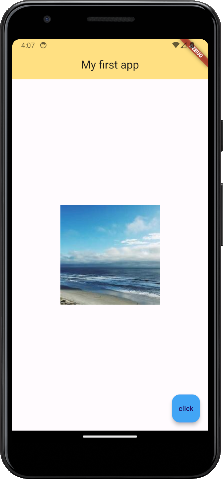

</div>

##### Network Image

A network image is fetched from a URL when the app runs. This is appropriate for content that changes over time: user avatars, product photos fetched from a server, or any image that is not known at build time. There are two equivalent ways to display a network image:

```dart
// Option 1: Using the Image widget with NetworkImage as the provider
body: Center(
  child: Image(
    image: NetworkImage('https://picsum.photos/200'),
  ),
),
```

```dart
// Option 2: Shorthand constructor — cleaner and more commonly used
body: Center(
  child: Image.network('https://picsum.photos/200'),
),
```

Both produce the same result. `Image.network()` is the shorthand and is the preferred form in most codebases.

**Useful properties for controlling how the image displays:**

```dart
Image.network(
  'https://picsum.photos/400/200',
  width: 300.0,
  height: 150.0,
  fit: BoxFit.cover,    // How the image fills its box — like CSS object-fit
)
```

**`BoxFit` values — how the image fills its bounding box:**

| Value | Behaviour |
|---|---|
| `BoxFit.contain` | Scales to fit entirely within the box, preserving aspect ratio |
| `BoxFit.cover` | Scales to fill the entire box, cropping if needed (most common for thumbnails) |
| `BoxFit.fill` | Stretches to fill the box exactly, ignoring aspect ratio |
| `BoxFit.fitWidth` | Scales until the width fills the box |
| `BoxFit.fitHeight` | Scales until the height fills the box |

> **A note on error handling:** Network images can fail — the URL may be invalid, or the device may be offline. In production apps, always provide an `errorBuilder` to handle failures gracefully:
> ```dart
> Image.network(
>   'https://picsum.photos/200',
>   errorBuilder: (context, error, stackTrace) {
>     return Icon(Icons.broken_image, size: 60.0, color: Colors.grey);
>   },
> )
> ```

---

##### Asset Image

<div align="center">

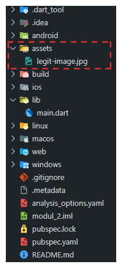

</div>

An asset image is a file stored *inside* your Flutter project and bundled with the app when it is compiled. This is appropriate for images that are always the same: app logos, placeholder graphics, decorative illustrations, icons. Using asset images requires two steps: registering the file with Flutter, and then referencing it in code.

**Step 1 — Add the image file to the project**

Create an `assets/` folder at the root of your project (the same level as `pubspec.yaml`) and place your image files there.

```
my_flutter_project/
├── assets/
│   └── my_image.jpg        ← place images here
├── lib/
│   └── main.dart
└── pubspec.yaml
```

**Step 2 — Register the asset in `pubspec.yaml`**

Flutter does not automatically discover files in your project. Every asset must be explicitly declared in `pubspec.yaml`. Open the file and add the `assets` section under `flutter:`:

```yaml
flutter:
  uses-material-design: true
  assets:
    - assets/my_image.jpg          # register a specific file
    # OR, to include every file in the folder:
    - assets/                      # register the entire directory (note the trailing slash)
```

> **Indentation is critical in YAML.** Use exactly 2 spaces for each level of indentation, not tabs. A common error (`Error: unable to find directory entry in pubspec.yaml`) is almost always caused by incorrect indentation. After editing `pubspec.yaml`, Flutter automatically runs `flutter pub get` on save.

**Step 3 — Display the image in code**

```dart
// Option 1: Using the Image widget with AssetImage as the provider
body: Center(
  child: Image(
    image: AssetImage('assets/my_image.jpg'),
  ),
),
```

```dart
// Option 2: Shorthand constructor — preferred
body: Center(
  child: Image.asset('assets/my_image.jpg'),
),
```

**Common mistakes with asset images:**

```dart
// ❌ Wrong — the path in the code does not match pubspec.yaml
// pubspec.yaml has: - assets/my_image.jpg
// Code has:
Image.asset('my_image.jpg')   // missing the 'assets/' prefix

// ✅ Correct — path must match exactly what is declared in pubspec.yaml
Image.asset('assets/my_image.jpg')
```

> **Path must match exactly.** The string passed to `Image.asset()` must be identical to the path declared in `pubspec.yaml`, including the folder prefix. A mismatch will cause a runtime error: *"Unable to load asset"*.

## Buttons & Icons

Buttons and icons are essential widgets in Flutter for user interaction. Flutter provides various types of buttons and icons that can be customized to suit the app's design.

### Icons

Icons are visual symbols for representing actions, objects, or concepts. Flutter provides a wide range of icons that can be used in the app. To use an icon, we can use the `Icon` widget. Try changing the `body` of `Scaffold` to display an icon.

```dart
body: Center(
  child: Icon(
    Icons.ac_unit,
    color: Colors.lightBlue,
    size: 50.0,
  ),
),
```

<div align="center">

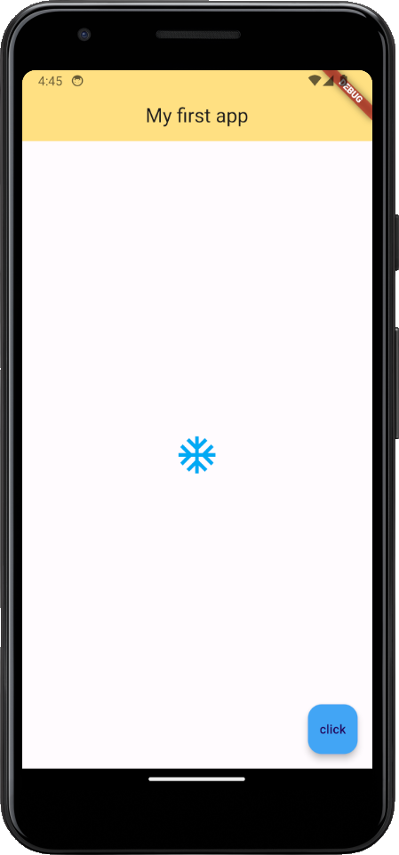

</div>

Tips: you can click `Ctrl` + `Space` to see the available icons or the attribute.

<div align="center">

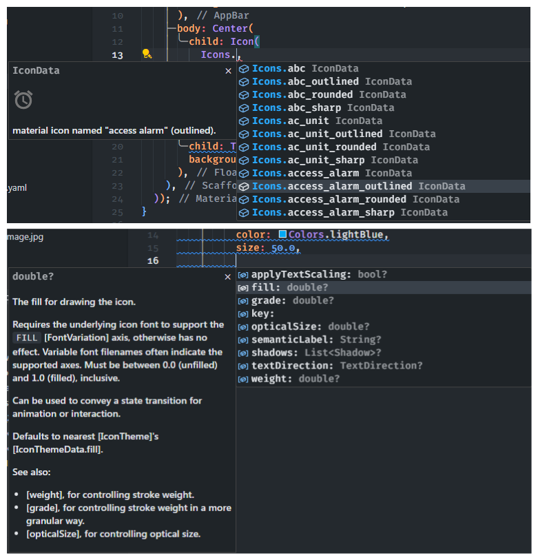

</div>

### Buttons

Buttons are used to trigger an action when clicked. Flutter provides various types of buttons, such as `ElevatedButton`, `TextButton`, and `OutlinedButton`. To use a button, we can use the `ElevatedButton` widget. Try changing the `floatingActionButton` of `Scaffold` to display a button.

```dart
floatingActionButton: ElevatedButton(
  onPressed: () {},
  child: Text('click'),
),
```

Try using the `TextButton` and `OutlinedButton` widgets to see the different button styles.

<div align="center">

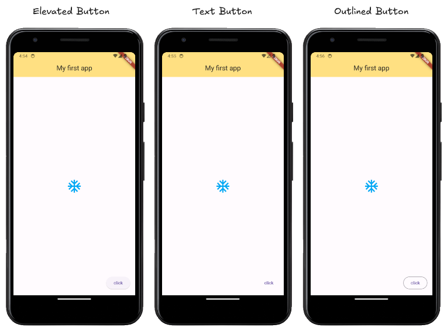

</div>

Buttons can be styled using the `style` property of the button widget. The `style` property can be used to set the button's text style, background color, and more.

```dart
floatingActionButton: ElevatedButton(
  onPressed: () {},
  child: Icon(Icons.add),
  style: ElevatedButton.styleFrom(
    backgroundColor: Colors.lightBlue,
    shape: CircleBorder(),
    padding: EdgeInsets.all(20.0),
  ),
),
```

<div align="center">

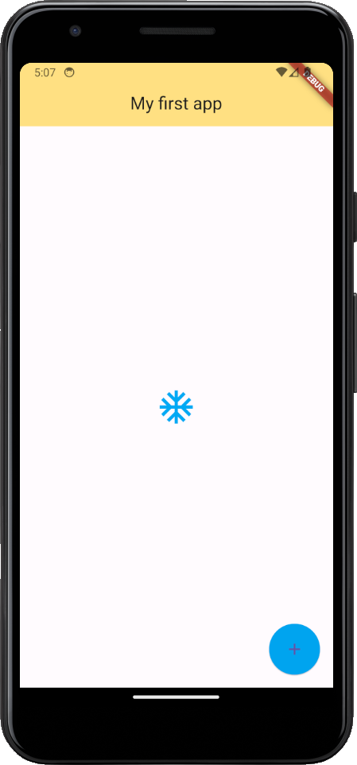

</div>

## Containers & Padding

Containers are used to create a visual element in the app. Containers can be adjusted in terms of size, padding, margin, and more. Here is the illustration of the container with padding and margin.

<div align="center">

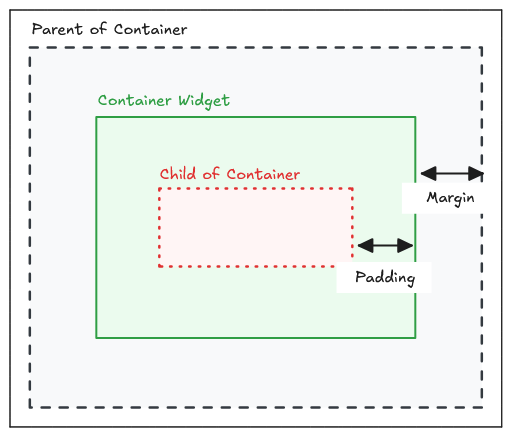

</div>

To create a container with padding and margin, we can use the `Container` widget with the `padding` and `margin` property.

```dart
body: Container(
  padding: EdgeInsets.all(20.0),
  margin: EdgeInsets.all(20.0),
  color: Colors.amber,
  child: Text('This is container'),
),
```

<div align="center">

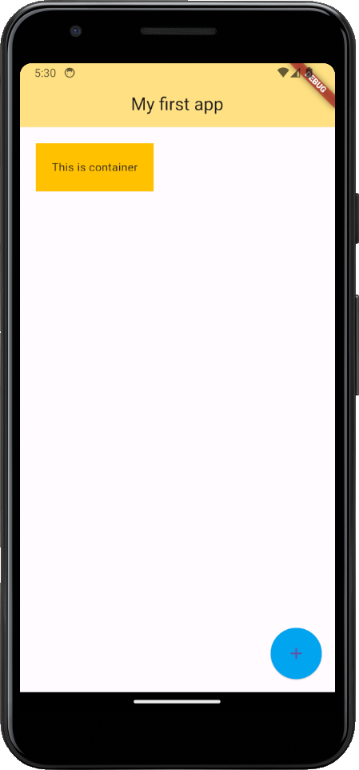

</div>

Padding and margin property are using `EdgeInsets` class to set the padding and margin. The `EdgeInsets` class provides various methods to set the padding and margin, such as `all`, `only`, `symmetric`, and more.

```dart
padding: EdgeInsets.all(20.0), // all sides
padding: EdgeInsets.only(left: 20.0), // only left side
padding: EdgeInsets.symmetric(horizontal: 20.0), // horizontal sides
padding: EdgeInsets.fromLTRB(10.0, 20.0, 30.0, 40.0), // left, top, right, bottom
```

If we want to only add padding to the child widget, we can use the `Padding` widget instead of the `padding` property of the `Container` widget.

```dart
body: Padding(
  padding: EdgeInsets.all(40.0),
  child: Text('Hello World!'),
),
```

<div align="center">

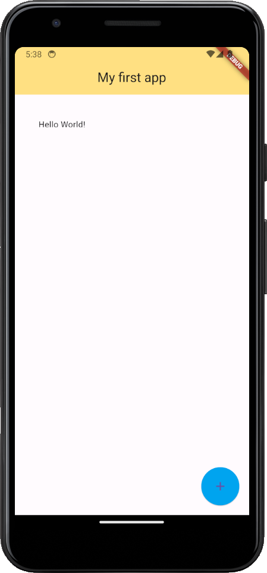

</div>

## Challenge

Can you recreate this layout using the widgets we have learned so far?

<div align="center">

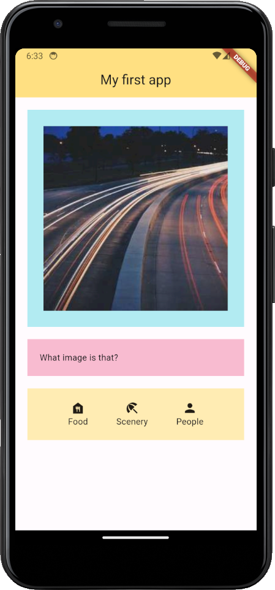

</div>


